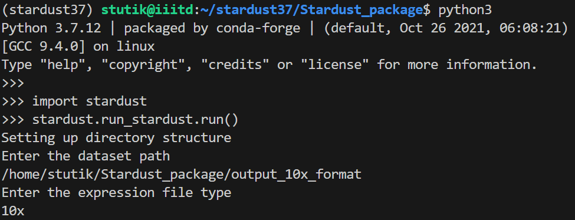
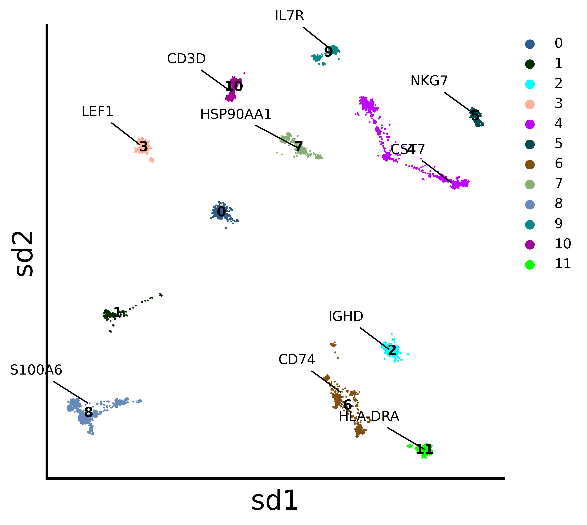
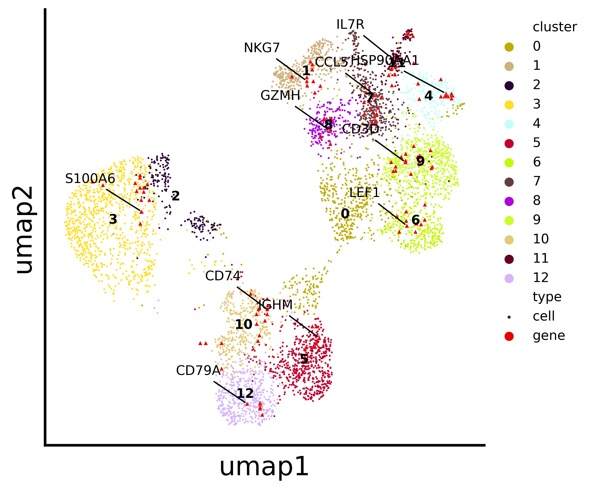
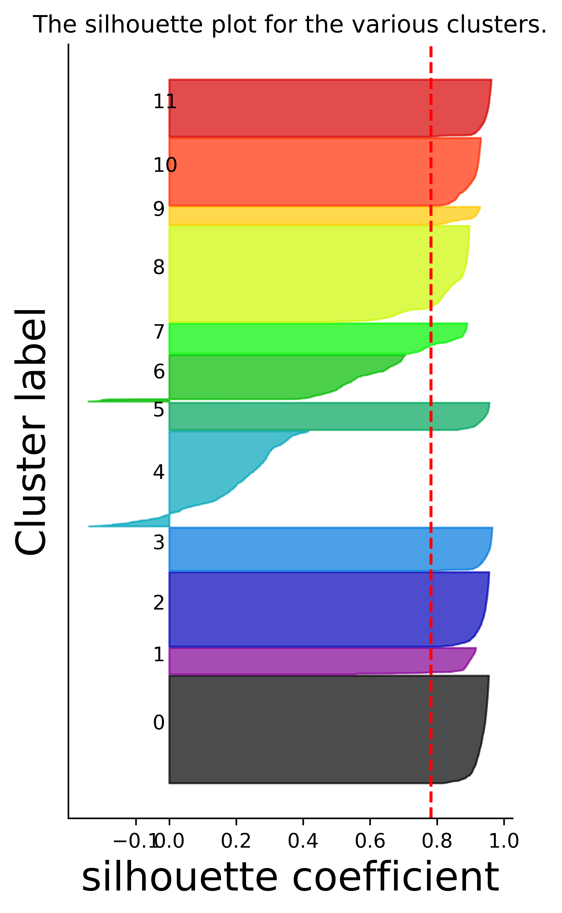
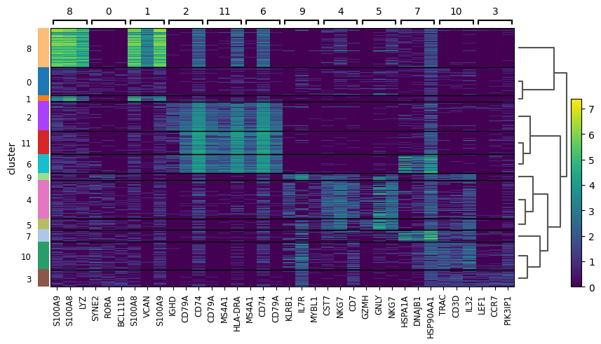

# Stardust: Simultaneous visualisation of cells and marker genes from scRNA-seq studies

Python package for cell-gene coembedding and analysis pipeline for single cell transcriptomics data. It enables simultaneous representation of cells and marker genes, preserving both transcriptional similarity and inferred spatial proximity.

-   [Installation](#installation-guide)
-   [Dataset Format](#dataset_support_format)
-   [Usage](#usage)
-   [Tutorial](#vignette-tutorial)
       -  [Co-embedding](#cell-gene-co-embedding)
   -   [Analysis](#analysis)
       -  [Silhouette](#silhouette-co-efficient)
       -  [Marker Heatmap](#marker-heatmap)
       -  [Alluvial](#alluvial-plot)
       -  
For thorough details, see our paper: [https://www.biorxiv.org/content/10.1101/2022.12.27.521966v2](https://www.biorxiv.org/content/10.1101/2022.12.27.521966v2) 
## Environment reqirements

Pyhton 3.7 or above with setuptools instaled.

## Installation Guide

Download the package directly from github. For linux users
```bash
https://github.com/Swagatam123/Stardust_package.git
```
Download the binary openOrd.jar from the release tag v1.0 and place it under Stardust_package/stardust/run_stardust/
Change the directoery to the package directory
```bash
cd Stardust_package/
```
Use the package manager [pip](https://pip.pypa.io/en/stable/) to install package.

```bash
pip install .
```

## Dataset support fomrat

The package supports 10x genomics data with .10x file format and csv file with the filename expression.csv
The expression data should contain the cells rowwise and genes columnwise.

## Usage

```python
import stardust

stardust.run_stardust.run() #generated the coembedding plots under Stardust_resuts/visualization_output/4_pass.
stardust.analysis.silhouette() # optional for analysis purpose
stardust.analysis.heatmap()   # optional for analysis purpose
stardust.analysis.alluvial()  # optional for analysis purpose
```
## Vignette tutorial
This vignette uses a melanoma data set from the website [here](https://singlecell.broadinstitute.org/single_cell/study/SCP11/melanoma-intra-tumor-heterogeneity) to demonstrate a standard pipeline. This vignette can be used as a tutorial as well.

### cell-gene co-embedding
To re-produce the cell-gene co-embedding visualization you need to run the following commands

```python
import stardust

stardust.run_stardust.run() #generated the coembedding plots under Stardust_resuts/visualization_output/4_pass.
```
On run command, you need to provide the expression matrix path and the file format (i.e either "csv" or "10x" ). 
NOTE: For csv file format, the expression file name should be "expression.csv"


#### co-embedding on Stardust
<!-- -->
#### co-embedding on UMAP
<!-- -->
### analysis
NOTE: To run the analysis functions you need to run the cell-gene co-embedding. 
#### silhouette co-efficient
```python
stardust.analysis.silhouette()
```
<!-- -->
#### marker heatmap
```python
stardust.analysis.heatmap()
```
<!-- -->
#### alluvial plot
```python
stardust.analysis.alluvial()
```
<!-- -->
## Output Directory structure
The embedding plots at its related data will be available in Stardust_results/visualization_output/4_pass

## Contributing
Pull requests are welcome. For major changes, please open an issue first to discuss what you would like to change.
