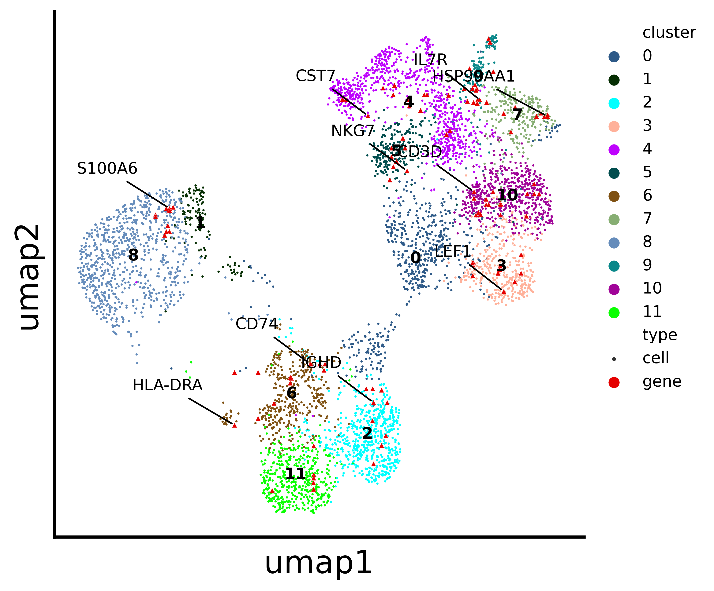

# Stardust: Simultaneous visualisation of cells and marker genes from scRNA-seq studies

Python package for cell-gene coembedding and analysis pipeline for single cell transcriptomics data. It enables simultaneous representation of cells and marker genes, preserving both transcriptional similarity and inferred spatial proximity.

-   [Installation](#installation-guide)
-   [Dataset Format](#dataset_support_format)
-   [Usage](#usage)
-   [Tutorial](#vignette-tutorial)
       -  [Co-embedding](#cell-gene-co-embedding)
   -   [Analysis](#analysis)
       -  [Silhouette](#silhouette-co-efficient)
       -  [Marker Heatmap](#marker-heatmap)
       -  [Alluvial](#alluvial-plot)
       -  
For thorough details, see our paper: [https://www.biorxiv.org/content/10.1101/2022.12.27.521966v2](https://www.biorxiv.org/content/10.1101/2022.12.27.521966v2) 

## Environment requirements

To install the Stardust package, you must make sure that your Python version is 3.7 or above with setuptools installed.

## Installation Guide
Step 1: Download the package directly from GitHub. For linux users
```bash
https://github.com/namratabhattacharya/Stardust.git
```
Step 2: Download the binary openOrd.jar from the release tag v1.0 and place it under Stardust_package/stardust/run_stardust/

Step 3. Change the directory to the package directory
```bash
cd Stardust_package/
```
Step 4: Use the package manager [pip](https://pip.pypa.io/en/stable/) to install the package.
```bash
pip install .
```

## Dataset support format

Stardust accepts single-cell expression data in the following formats:
	•	CSV Format:
A gene expression matrix file named expression.csv, with cells as rows and genes as columns.
🔹 An example dataset is provided in the example_data/csv/ folder.
	•	10x Genomics Format:
Standard .10x output files from the 10x Genomics Cell Ranger pipeline.
🔹 An example dataset is provided in the example_data/10x/ folder.

## Usage

```python
import stardust

stardust.run_stardust.run() #generated the coembedding plots under Stardust_resuts/visualization_output/4_pass.
stardust.analysis.silhouette() # optional for analysis purpose
stardust.analysis.heatmap()   # optional for analysis purpose
stardust.analysis.alluvial()  # optional for analysis purpose
```
Outputs are saved under:
Stardust_results/visualization_output/4_pass/

## Vignette tutorial
This vignette uses a melanoma data set from the website [here](https://singlecell.broadinstitute.org/single_cell/study/SCP11/melanoma-intra-tumor-heterogeneity) to demonstrate a standard pipeline. This vignette can be used as a tutorial as well.

### cell-gene co-embedding
To reproduce the cell-gene co-embedding visualisation ,you need to run the following commands

```python
import stardust

stardust.run_stardust.run() #generated the coembedding plots under Stardust_resuts/visualization_output/4_pass.
```
On run command, you need to provide the expression matrix path and the file format (i.e either "csv" or "10x" ). 
NOTE: For CSV file format, the expression file name should be "expression.csv"


#### co-embedding on Stardust
<!-- -->
#### co-embedding on UMAP
<!-- -->
### analysis
NOTE: To run the analysis functions, you need to run the cell-gene co-embedding. 
#### silhouette co-efficient
```python
stardust.analysis.silhouette()
```
<!-- -->
#### marker heatmap
```python
stardust.analysis.heatmap()
```
<!-- -->
#### alluvial plot
```python
stardust.analysis.alluvial()
```
<!-- -->
## Output Directory structure
	•	Stardust_results/visualization_output/4_pass:
Contains co-embedding plots, CSV outputs, and layout files
	•	Stardust_results/analysis/:
Contains silhouette scores, marker gene heatmaps, and alluvial diagrams

## Contributing
Souce code: [Github](https://github.com/namratabhattacharya/Stardust.git)  
For further information, contact debarka@iiitd.ac.in or n.bhattacharya@qut.eu.au. 
